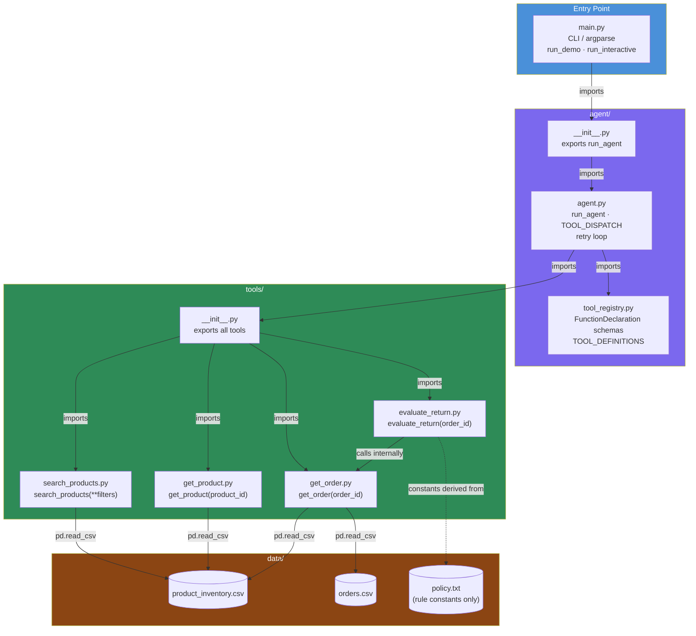
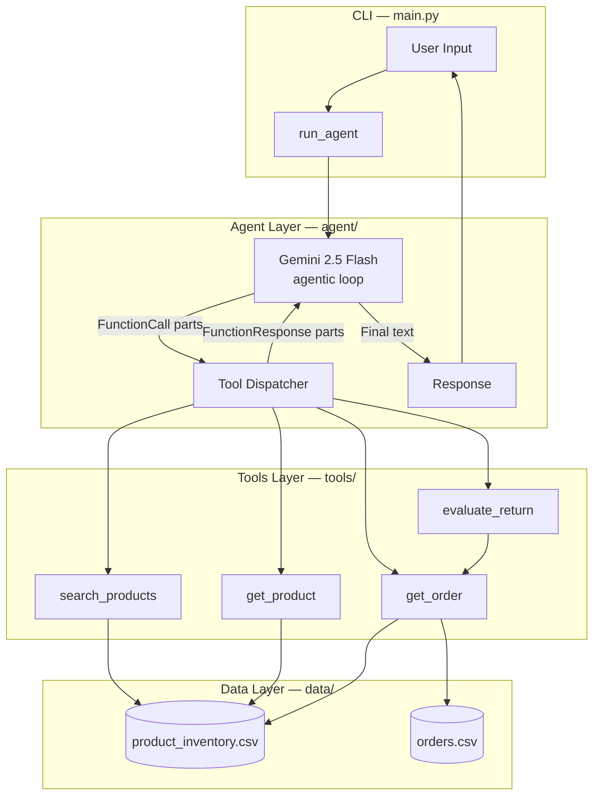
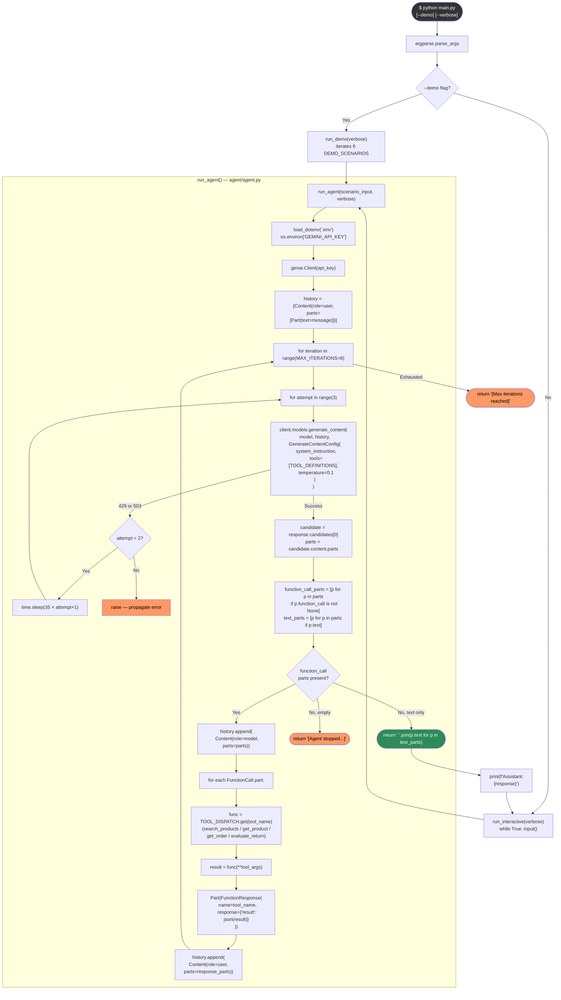
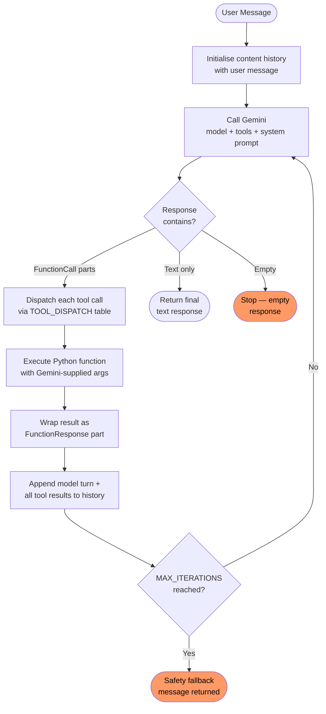
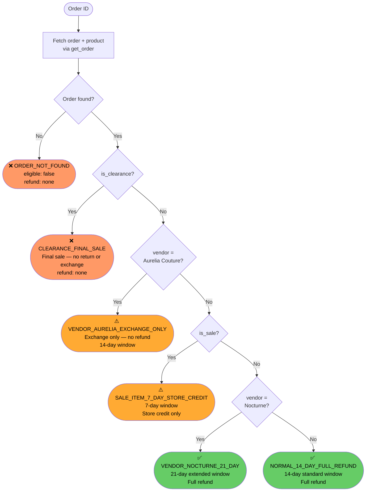
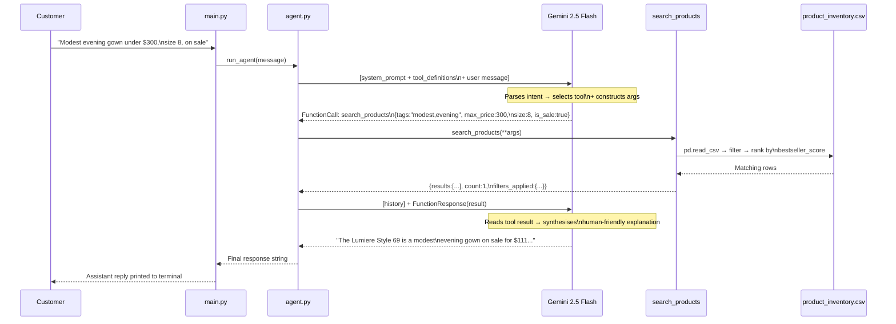

# Retail AI Assistant — Fashion Boutique

> Exam submission for the Retail AI Agent assignment.
> Built with Google Gemini 2.5 Flash · `google-genai` SDK · Python 3.11

---

## Index

1. [What This Is](#what-this-is)
2. [Requirements Coverage](#requirements-coverage)
3. [Project Structure](#project-structure)
4. [File Dependency Map](#file-dependency-map)
5. [Architecture](#architecture)
6. [Code Execution Flowchart](#code-execution-flowchart)
7. [Agentic Loop](#agentic-loop)
8. [Return Policy Decision Chain](#return-policy-decision-chain)
9. [End-to-End Tool Call Trace](#end-to-end-tool-call-trace)
10. [Solution Design — Key Decisions](#solution-design--key-decisions)
11. [Setup & Running](#setup--running)
12. [Demo Scenarios](#demo-scenarios)
13. [Dependencies](#dependencies)
14. [Free Tier Note](#free-tier-note)

---

## What This Is

A single agentic AI assistant for a women's fashion boutique that handles two things:

- **Personal Shopping** — filters the product catalogue by any combination of style, size, price, and sale status, then recommends the top match with justification
- **Customer Support** — evaluates return/exchange eligibility against the store policy and delivers a clear, accurate decision

The agent is powered by Gemini's native function-calling API. It orchestrates four pure-Python tools to retrieve data and evaluate policy. The LLM never sees raw inventory or order data — it only receives tool results.

---

## Requirements Coverage

Every requirement from `architecture.md` is implemented. The table below maps each spec requirement to its implementation location.

| Requirement | Status | Implementation |
|-------------|--------|----------------|
| Single agentic loop handling shopping + support | ✅ | `agent/agent.py` — `run_agent()` |
| Powered by Google Gemini with `google-genai` SDK | ✅ | `agent/agent.py` L22, model: `gemini-2.5-flash`* |
| Structured function calling | ✅ | `agent/tool_registry.py` — `FunctionDeclaration` schemas |
| `search_products` tool | ✅ | `tools/search_products.py` |
| `get_product` tool | ✅ | `tools/get_product.py` |
| `get_order` tool | ✅ | `tools/get_order.py` |
| `evaluate_return` tool | ✅ | `tools/evaluate_return.py` |
| Tools read from CSV data files | ✅ | All tools use `data/product_inventory.csv` + `data/orders.csv` |
| Tool descriptions drive tool selection | ✅ | `agent/tool_registry.py` — description fields |
| Multi-turn function calling loop | ✅ | `agent/agent.py` L102–183 |
| `MAX_ITERATIONS` safety guard | ✅ | `agent/agent.py` L74, set to 8 |
| No product data in system prompt | ✅ | `SYSTEM_PROMPT` in `agent/agent.py` contains zero inventory data |
| Explicit errors for missing IDs | ✅ | All tools return `{"error": "..."}` for missing records |
| Deterministic policy engine | ✅ | `tools/evaluate_return.py` — priority rule chain |
| `bestseller_score` ranking | ✅ | `tools/search_products.py` L121 |
| Orders joined with product data | ✅ | `tools/get_order.py` — enriches order with product record |

\* Spec specifies `gemini-2.0-flash`. Substituted with `gemini-2.5-flash` because the project's API key had exhausted its `gemini-2.0-flash` free-tier quota (daily limit: 0 due to project-level provisioning). `gemini-2.5-flash` is the direct successor with identical function-calling support.

---

## Project Structure

```
retail-ai-agent/
│
├── main.py                     # CLI entry point — interactive & demo modes
├── requirements.txt            # Python dependencies
├── .env                        # GEMINI_API_KEY (gitignored — never committed)
├── .env.example                # Key template for first-time setup
├── architecture.md             # Original assignment specification
│
├── agent/                      # Agent layer — Gemini loop + tool schemas
│   ├── README.md               # ← agent package documentation
│   ├── __init__.py             # Exports run_agent as public interface
│   ├── agent.py                # Core agentic loop, retry logic, tool dispatch
│   └── tool_registry.py        # Gemini FunctionDeclaration schemas (all 4 tools)
│
├── tools/                      # Tools layer — pure Python, no LLM calls
│   ├── README.md               # ← tools package documentation
│   ├── __init__.py             # Exports all four tool functions
│   ├── search_products.py      # Multi-filter product search, ranked by score
│   ├── get_product.py          # Single product lookup by product_id
│   ├── get_order.py            # Order fetch joined with product details
│   └── evaluate_return.py      # Deterministic return policy engine
│
└── data/                       # Data layer — CSV files and policy text
    ├── README.md               # ← data files documentation
    ├── product_inventory.csv   # 100-product catalogue with stock, tags, pricing
    ├── orders.csv              # Customer order history (order → product → customer)
    └── policy.txt              # Human-readable return policy (source of truth)
```

---

## File Dependency Map

Shows which files import which, and which tools read which data files.



---

## Architecture



---

## Code Execution Flowchart

Full Python execution path from `python main.py` to the final printed response.



---

## Agentic Loop

The agent runs Gemini in a multi-turn loop. Each iteration inspects the response parts: if Gemini returned `FunctionCall` parts, the tools are dispatched and results fed back as `FunctionResponse`; if Gemini returned text only, the loop exits and returns the response.



---

## Return Policy Decision Chain

`evaluate_return` encodes all six policy rules as a deterministic priority chain. The first rule that matches fires — lower rules are not evaluated.



---

## End-to-End Tool Call Trace

How a single customer message moves through every layer (shopping example):



---

## Solution Design — Key Decisions

### 1. Hallucination prevention via tool-gating

No product or order data appears in the system prompt. The model cannot name a product, quote a price, or confirm a stock level without calling a tool in that turn. If a tool returns `{"error": "..."}`, the system prompt instructs the model to relay it honestly — it cannot guess an alternative. Three layers enforce this:

- No inventory data in context
- Explicit `{"error": "..."}` contracts for all tools on missing IDs
- System prompt: *"Never mention a product name, price, or stock level you have not fetched via a tool call in this conversation"*

### 2. Policy as deterministic code, not LLM reasoning

Return eligibility is not computed by the LLM reasoning over a policy paragraph. It is implemented as a six-rule priority chain in Python (`evaluate_return.py`). The LLM's only job is writing a warm explanation of the already-computed decision. This guarantees correctness across model versions and cannot be bypassed by clever prompt phrasing.

### 3. Tool descriptions as selection prompts

The `description` field of each `FunctionDeclaration` is written to be non-overlapping and intent-specific. Descriptions include explicit negative instructions to prevent wrong tool selection:

- `search_products` — *"Always use this before recommending products — never invent product names"*
- `evaluate_return` — *"ALWAYS use this (not manual reasoning) when a customer asks about returning"*
- `get_product` — *"Do NOT use this for browsing or searching; use search_products for that"*

### 4. Order enrichment at retrieval time

`get_order` joins the order record with the current product record before returning. This gives `evaluate_return` (which calls `get_order` internally) a single coherent object containing both transaction data (price paid, size, date) and current product state (is_clearance, is_sale, vendor). Splitting this into two separate tool calls would create a race condition if product state changed between calls.

### 5. Dispatch table over switch/conditionals

Tool routing uses a `TOOL_DISPATCH` dict that maps Gemini's function call names to Python callables. Adding a new tool requires three lines total: one function file, one `FunctionDeclaration`, one dict entry. No routing logic changes anywhere.

---

## Setup & Running

### Prerequisites

- Python 3.11 (conda env `ml` or equivalent)
- Google AI Studio API key — [aistudio.google.com/apikey](https://aistudio.google.com/apikey)
  - Create the key in a **new project** to ensure free-tier quota is provisioned

### Install

```bash
cd retail-ai-agent
conda activate ml
pip install -r requirements.txt
```

### Configure

```bash
cp .env.example .env
# Open .env and set:
# GEMINI_API_KEY=AIzaSy...your_key_here
```

### Run

```bash
# Interactive mode
python main.py

# Demo — 6 preset scenarios (shopping + returns + edge cases)
python main.py --demo

# Demo with full tool call trace printed to stderr
python main.py --demo --verbose
```

---

## Demo Scenarios

| # | Mode | Scenario | Tools Called |
|---|------|----------|-------------|
| 1 | Shopping | Modest evening gown, size 8, under $300, on sale | `search_products` |
| 2 | Shopping | Cocktail dress, size 10, under $200 | `search_products` |
| 3 | Support | Order O0004 — Nocturne 21-day extended window | `evaluate_return` |
| 4 | Support | Order O0003 — Clearance, final sale | `evaluate_return` |
| 5 | Support | Order O0012 — Aurelia Couture, exchange only | `evaluate_return` |
| 6 | Edge case | Non-existent order O9999 | `evaluate_return` |

---

## Dependencies

| Package | Version | Purpose |
|---------|---------|---------|
| `google-genai` | ≥ 2.0.0 | Gemini API client — function calling, content generation |
| `pandas` | ≥ 2.0.0 | CSV loading and filtering for product/order data |
| `python-dateutil` | ≥ 2.8.0 | Date parsing for return window day calculations |
| `python-dotenv` | ≥ 1.0.0 | Load `GEMINI_API_KEY` from `.env` file |

---

## Free Tier Note

Gemini 2.5 Flash free tier: **20 requests/day, 5 requests/minute**. The full demo uses approximately 12–14 API calls. Running all 6 scenarios back-to-back may hit the per-minute limit. The agent handles this automatically with a retry loop (up to 2 retries, 35s apart) before surfacing an error.
