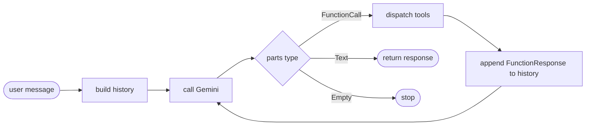

# agent/

The agent package is the core engine of the system. It owns two responsibilities: **orchestrating the Gemini agentic loop** (`agent.py`) and **declaring tool schemas** to Gemini (`tool_registry.py`).

---

## Files

| File | Role |
|------|------|
| `__init__.py` | Package entry point — exports `run_agent` as the sole public interface |
| `agent.py` | Runs the multi-turn Gemini function-calling loop |
| `tool_registry.py` | Defines `FunctionDeclaration` schemas for all four tools |

---

## Public Interface

```python
from agent import run_agent

response: str = run_agent(user_message="...", verbose=False)
```

`run_agent` is the only function `main.py` calls. Everything else in this package is an implementation detail.

---

## agent.py

### What it does

Runs a single conversational turn through the Gemini agentic loop. The loop continues until Gemini produces a text-only response (no function calls) or the `MAX_ITERATIONS` guard fires.

### Key constants

| Constant | Value | Purpose |
|----------|-------|---------|
| `MODEL` | `gemini-2.5-flash` | Gemini model used for all calls |
| `MAX_ITERATIONS` | `8` | Safety cap on tool-calling rounds per turn |
| `SYSTEM_PROMPT` | see file | Defines agent behaviour, modes, and strict rules |
| `TOOL_DISPATCH` | dict | Maps Gemini tool name strings → Python callables |

### Loop logic



### Retry behaviour

Each `generate_content` call is wrapped in a 3-attempt retry loop. On `429 RESOURCE_EXHAUSTED` or `503 UNAVAILABLE`, the loop sleeps `35 × attempt` seconds before retrying. On the third failure, the exception propagates.

### Hallucination prevention

The `SYSTEM_PROMPT` contains **no product or order data**. It instructs Gemini to:
- Never mention a product name, price, or stock level without a prior tool call
- Relay `{"error": "..."}` tool results honestly, without inventing alternatives
- Always use `evaluate_return` for return decisions — never reason from memory

### Tool dispatch table

```python
TOOL_DISPATCH = {
    "search_products": search_products,   # tools/search_products.py
    "get_product":     get_product,       # tools/get_product.py
    "get_order":       get_order,         # tools/get_order.py
    "evaluate_return": evaluate_return,   # tools/evaluate_return.py
}
```

Gemini returns a `tool_name` string in each `FunctionCall`. The dispatch table converts that string to the Python callable. Unknown tool names produce `{"error": "Unknown tool: <name>"}` — they don't crash the loop.

---

## tool_registry.py

### What it does

Defines the `FunctionDeclaration` objects that tell Gemini what tools exist, what arguments they accept, and when to call them. These declarations are passed to every `generate_content` call inside `TOOL_DEFINITIONS`.

### Why descriptions matter

The `description` field of each `FunctionDeclaration` acts as a selection prompt. Gemini reads it to decide which tool to call for a given customer message. All four descriptions are written to be non-overlapping:

| Tool | Trigger phrase in description |
|------|-------------------------------|
| `search_products` | "browsing or searching… Always use this before recommending" |
| `get_product` | "specific product ID… Do NOT use this for browsing" |
| `get_order` | "specific order… raw order lookup" |
| `evaluate_return` | "ALWAYS use this… when a customer asks about returning" |

### Schema structure

```
TOOL_DEFINITIONS = Tool(
    function_declarations = [
        FunctionDeclaration(search_products_fn),
        FunctionDeclaration(get_product_fn),
        FunctionDeclaration(get_order_fn),
        FunctionDeclaration(evaluate_return_fn),
    ]
)
```

Each `FunctionDeclaration` uses `Schema(type=OBJECT, properties={...})` to declare typed parameters. Gemini constructs `fc.args` from these schemas when it generates a function call — the agent receives them as a dict and unpacks with `func(**tool_args)`.

### Adding a new tool

1. Write the Python function in `tools/`
2. Add a `FunctionDeclaration` here following the same pattern
3. Add one entry to `TOOL_DISPATCH` in `agent.py`

No other files need to change.
