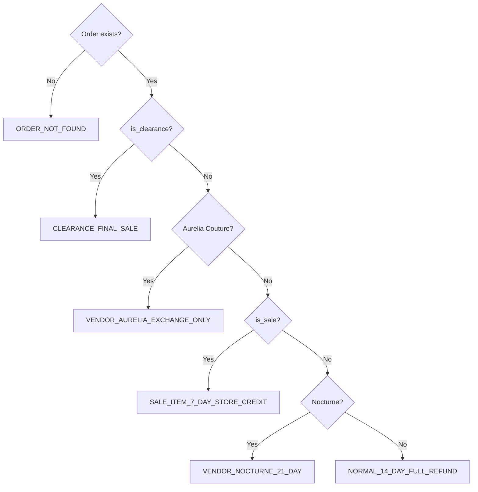

# tools/

Pure-Python tool functions used by the Gemini agentic loop. No LLM calls occur inside any tool — they perform data retrieval and rule evaluation only.

---

## Contract

Every tool follows the same return contract:

- **Success** → returns a plain `dict` with the requested data
- **Failure** → returns `{"error": "<human-readable message>"}` — never raises, never guesses

The agent relays error dicts to the customer as-is. This prevents silent hallucination — if the data doesn't exist, the model has nothing to say.

---

## Files

| File | Function | Data source |
|------|----------|-------------|
| `search_products.py` | `search_products(**filters)` | `data/product_inventory.csv` |
| `get_product.py` | `get_product(product_id)` | `data/product_inventory.csv` |
| `get_order.py` | `get_order(order_id)` | `data/orders.csv` + `data/product_inventory.csv` |
| `evaluate_return.py` | `evaluate_return(order_id)` | calls `get_order` internally |

---

## search_products

Filters the product inventory by any combination of constraints and returns results ranked by `bestseller_score` descending.

### Signature

```python
def search_products(**filters) -> dict
```

All kwargs are optional. Gemini supplies whichever filters are relevant to the customer's request.

### Filters

| Filter | Type | Behaviour |
|--------|------|-----------|
| `tags` | `str` | Comma-separated tags. All must match (AND logic). |
| `max_price` | `float` | Inclusive upper price bound |
| `min_price` | `float` | Inclusive lower price bound |
| `size` | `int` | Only returns products with this size in stock (`qty > 0`) |
| `is_sale` | `bool` | Sale items only |
| `is_clearance` | `bool` | Clearance items only |
| `vendor` | `str` | Exact vendor name, case-insensitive |
| `limit` | `int` | Max results (default 5) |

### Tag logic

Tags use AND logic — a product must carry **all** requested tags to qualify. A request for `"modest,evening"` excludes products tagged only `"evening"`.

```python
row_tag_set = {t.strip().lower() for t in str(row_tags).split(",")}
return all(t in row_tag_set for t in tag_list)
```

### Return shape

```json
{
  "results": [
    {
      "product_id": "P0069",
      "title": "Lumiere Style 69",
      "vendor": "Lumiere",
      "price": 111.0,
      "compare_at_price": 171.0,
      "tags": "modest,cocktail,evening",
      "sizes_available": "8|2|16|14|4",
      "is_sale": true,
      "is_clearance": false,
      "bestseller_score": 27,
      "stock_for_requested_size": 20
    }
  ],
  "count": 1,
  "filters_applied": { "tags": ["modest", "evening"], "max_price": 300, "is_sale": true, "size": 8 }
}
```

`stock_for_requested_size` is only included when `size` was passed as a filter.

---

## get_product

Fetches the full record for a single product by `product_id`.

### Signature

```python
def get_product(product_id: str) -> dict
```

### When to use

Only when a specific product ID is already known (e.g., from a prior `search_products` call). For browsing, use `search_products`.

### Return shape (success)

```json
{
  "product_id": "P0003",
  "title": "Aurelia Couture Style 3",
  "vendor": "Aurelia Couture",
  "price": 263.0,
  "compare_at_price": 303.0,
  "tags": "lace,bridal,prom",
  "sizes_available": "10|14|2|8|12|4|16",
  "stock_per_size": { "10": 17, "14": 9, "2": 20, "8": 19, "12": 11, "4": 18, "16": 6 },
  "is_sale": true,
  "is_clearance": false,
  "bestseller_score": 99
}
```

### Return shape (not found)

```json
{ "error": "Product 'P9999' not found in inventory." }
```

---

## get_order

Fetches an order record by `order_id` and enriches it with the linked product's current attributes.

### Signature

```python
def get_order(order_id: str) -> dict
```

### Why it joins with products

Return eligibility depends on `is_clearance`, `is_sale`, and `vendor` — fields that live in the product record, not the order record. Joining at retrieval time gives the caller one coherent object rather than requiring two separate tool calls whose results could become inconsistent.

### Return shape (success)

```json
{
  "order_id": "O0004",
  "order_date": "2026-02-08",
  "product_id": "P0086",
  "size": 16,
  "price_paid": 316.0,
  "customer_id": "C004",
  "product_details": {
    "title": "Nocturne Style 86",
    "vendor": "Nocturne",
    "current_price": 316.0,
    "tags": "evening,flowy",
    "is_sale": false,
    "is_clearance": false,
    "stock_per_size": { "16": 3, "8": 7 }
  }
}
```

### Edge case — removed product

If the product was deleted from inventory after the order was placed, the order is still returned with `product_details: null` and a `warning` field. The agent can still surface the order existence without crashing.

---

## evaluate_return

Applies the store's return policy to an order and returns an authoritative eligibility decision.

### Signature

```python
def evaluate_return(order_id: str) -> dict
```

### Design rationale

Policy is encoded as Python logic — not left to LLM reasoning over a policy paragraph. This guarantees correctness regardless of how the customer phrases the question. The model writes the human explanation; this function produces the factual decision.

### Rule chain (priority order — first match wins)



### Policy constants

| Rule | Window | Refund type |
|------|--------|-------------|
| `CLEARANCE_FINAL_SALE` | 0 days | none |
| `VENDOR_AURELIA_EXCHANGE_ONLY` | 14 days | none (exchange only) |
| `SALE_ITEM_7_DAY_STORE_CREDIT` | 7 days | store credit |
| `VENDOR_NOCTURNE_21_DAY` | 21 days | full |
| `NORMAL_14_DAY_FULL_REFUND` | 14 days | full |

### Return shape

```json
{
  "order_id": "O0004",
  "order_date": "2026-02-08",
  "days_since_order": 93,
  "product_title": "Nocturne Style 86",
  "vendor": "Nocturne",
  "is_sale": false,
  "is_clearance": false,
  "size_ordered": 16,
  "price_paid": 316.0,
  "eligible": false,
  "exchange_only": false,
  "refund_type": "none",
  "policy_rule": "VENDOR_NOCTURNE_21_DAY",
  "window_days": 21,
  "days_remaining": -72,
  "reason": "Nocturne has an extended 21-day return window. Order was 93 day(s) ago — window has expired."
}
```

`days_remaining` is negative when the window has expired. The agent uses this to phrase the response correctly ("12 days remaining" vs "window closed 72 days ago").
